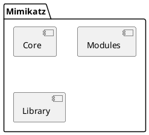

# Password and authentication credentials using Mimikatz


*Criedts for image (Varonis.com article - [What is Mimikatz? The Beginner&#39;s Guide (varonis.com)](https://www.varonis.com/blog/what-is-mimikatz))*

## 1. Motivation

To be a better security professional, one quick way to understand more is by observation and playing around with the current known mechanisms to better understand and have quicker hands-on experience. Today's small project is infamous Mimikatz tool that is used by security professionals and attackers alike.

Small note, at the end of this post a glossary table that you can use to understand more about the acronyms and abbreviations used here.

## 2. Introduction

### 2.1. About Mimikatz

Mimikatz is a powerful open-source tool developed by [Benjamin Delpy (gentilkiwi)](https://github.com/gentilkiwi/mimikatz)that allows users to extract sensitive information from Windows operating systems, such as passwords and credentials. It has gained popularity among security professionals and hackers alike due to its ability to exploit vulnerabilities and perform various security-related tasks.

### 2.2. Mimikatz functionalities

Mimikatz offers a wide range of functionalities related to Windows security and credential manipulation. Here are some of its key features:

* **Credential Extraction** : Mimikatz can retrieve plaintext passwords, hashes, and other credential information stored in Windows, including those used for local accounts, Active Directory, and cached credentials.
* **Pass-the-Hash** : This technique allows an attacker to authenticate to a remote system using the NTLM hash of a user's password, bypassing the need for the actual password.
* **Golden Ticket Attack** : Mimikatz can generate forged Kerberos tickets, known as Golden Tickets, by abusing the Kerberos authentication system. These tickets grant unauthorized access to a network by impersonating a domain controller.
* **Pass-the-Ticket** : With this technique, Mimikatz can extract and manipulate Kerberos tickets, allowing an attacker to impersonate a specific user or service.
* **Dumper** : Mimikatz includes various dumpers that extract and display information such as credentials stored in LSASS memory, domain-cached credentials, and security-related configurations.

### 2.3. Understanding the architecture and how Mimikatz works

#### 2.3.1. Architecture

Mimikatz follows a modular architecture that consists of several components working together to achieve its functionalities. Here is a high-level overview of its architecture:



* **Mimikatz Core** : The core component of Mimikatz provides the framework for loading modules, managing the command-line interface, and handling the interaction between different components.
* **Modules** : Modules in Mimikatz are responsible for performing specific tasks, such as credential extraction, token manipulation, and privilege escalation. Each module focuses on a particular functionality and can be loaded dynamically into the core.
* **Libraries** : Mimikatz leverages various libraries and APIs to interact with the Windows operating system and access sensitive information. These libraries provide the necessary functions for manipulating credentials, security subsystems, and other system components.

#### 2.3.1. Internal working

Mimikatz utilizes various Windows APIs and techniques to access and manipulate sensitive information. Here is a high-level overview of its working process:

1. **Loading** : When executed, Mimikatz loads its core component, which sets up the necessary infrastructure for subsequent operations.
2. **Module Loading** : Modules containing specific functionalities are dynamically loaded into the core. These modules are responsible for performing different tasks, such as credential extraction or ticket manipulation.
3. **API Interactions** : Mimikatz leverages Windows APIs, security subsystem libraries, and other system components to access and manipulate credentials, tokens, and security configurations.
4. **Credential Extraction** : Mimikatz interacts with the Windows security subsystem to extract credentials from various sources, such as LSASS memory, cached credentials, and domain controllers.
5. **Credential Manipulation** : Once credentials are extracted, Mimikatz can perform actions such as displaying plaintext passwords, generating hashes, or impersonating users or services.
6. **Post-Exploitation** : After extracting and manipulating credentials, Mimikatz can use the obtained information to gain unauthorized access, escalate privileges, or perform other post-exploitation activities.

### 2.4. List of supported modules

*[REF_MIMIKATZ_WIKI]*

Each module provides unique functionality and can be utilized for specific purposes. Below there is an overview of the different Mimikatz modules and their functionalities categorized by domain of utiliazation:

**1. Infrastructure helpers:**

* **mimilib** : Provides general support functions and structures for Mimikatz modules allowing more code portability and interoperability between modules.

**2. Credential manipulation and dumping:**

* **sekurlsa** : Interacts with the Local Security Authority Subsystem Service (LSASS) process to extract credentials, hashes, and other authentication-related information. It offers multiple sub-modules, including:
  * logonPasswords: Dumps plaintext passwords, NTLM hashes, and Kerberos tickets.
  * tickets: Manipulates Kerberos tickets.
  * dpapi: Decrypts or dumps data protected by the Data Protection API (DPAPI).
* **lsadump** : Offers various sub-modules to retrieve and manipulate data from the Local Security Authority (LSA) database, including:
  * sam: Dumps password hashes and other user account information from the Security Account Manager (SAM) database.
  * secrets: Extracts various secrets and credentials stored by Windows, such as autologon passwords and DPAPI backup keys.

**3. Token manipulation and impersonation:**

* **token** : Manipulates user tokens and provides functionalities for privilege escalation and impersonation.

**4. Kerberos-related operations:**

* **kerberos** : Performs operations related to Kerberos authentication, including:
  * ptt: Pass-the-ticket functionality, allowing the injection of Kerberos tickets into a user's session.

**5. Miscellaneous modules:**

* **service** : Manages services and can be used for installing, starting, and stopping services on the local or remote machine.
* **ts** : Manipulates Terminal Services sessions and credentials.
* **vault** : Dumps credentials and other information stored in the Windows Credential Manager (Vault).

## 3. Before we start

### 3.1. Enable the debugging in Mimikatz

To be able to understand the Mimikatz internal behavior we can build Mimikatz with **debugging enabled**. This configuration is not enabled by default but it's easy to be applied. Here's how:

1. I have created a new configuration originated from **Release** configuration using Visual Studio.
      
2. Now all my projects under the solution have a **Debug / x64** configuration.
   
3. Open mimikatz project Properties, then go to Linker >> Debugging and set all of the following fields with YES.
   
4. This will allow a *.pdb file to be generated that can be used for symbol synching between actual binary code in the process and VS source code.
5. Build the project `mimikatz` with this configuration, you will notice the PDB file that has been created next to the executable.
   

### 3.2. Remotely debug a VM with Visual Studio

Following this guide from Microsoft for remote debugging in VS [[REF_GUIDE_REMOTE_DBG](https://learn.microsoft.com/en-us/visualstudio/debugger/remote-debugging-cpp?view=vs-2022)]. Basically you will make sure of the following:

1. You have a VM with **Remote VS Tools** installed.
2. Your VM has a direct connection with your host, in my case I have configured the Network Adapter in the VM to have the following configuration:
   
   
3. At the host side I had changed my Virtual Network Adapter connection to be:
   
4. So basically I have now the following setup

   ```plantuml
   @startuml
   nwdiag {
   	network network{
   		address = "192.168.99.0/24"
   		host [address="19.168.99.1", description="<&laptop*5>\nHost"]
   		target [address="19.168.99.2", description="<&laptop*5>\nTarget"]
   	}
   }

   @enduml
   ```
5. Now on the target machine (VM) open Remote Debugger (Run as Adminstrator).
6. Go to Visual Sudio, "Debug >> Attach to Process ...." and then click find and connect to the entry.
7. Search for `mimikatz` in the process list and attach to this process.

## 4. Mimikatz in action (Dumping NTLM hash via SeDebugPrivilege)

This is the easiest usage of mimikatz, and this is mostly not real-attack senario as this requires admin privilege or a user with SeDebugPrivilege permission to parse the LSASS process data structures, parse and retrieve the credentials. But it's a good start to understand how Mimikatz work.

### 4.1. Setup

* Windows 10 (Version: 22H2) on Virtual Machine
  * With Realtime Protection and other Windows Security features disabled.
    This is important, as due to the popularity of mimikatz.exe process, Windows Defender detect it automatically as it's pattern is recorded in its IDS (Intrusion Detection System), sometimes it will auto qurantine the file.
* Running the `mimikatz.exe` (x64 variant) with admin privilege, due to the need to access the lsass.exe process and this can be done by giving the user access to `SeDebugPrivilege` permission *[[REF_ARTICLE_SeDebugPrivilege](https://devblogs.microsoft.com/oldnewthing/20080314-00/?p=23113)]*.
* ProcMon and ProcExplorer are running in the background to catch the trace for what has happened.

### 4.2. Steps

1. Prepare ProcMon for mimikatz.exe running, by applying a filter for focusing on `mimikatz.exe` process.
2. Launch ProcExplorer to understand what happened in the process tree.
3. Run `mimikatz.exe` in adminstrator privilege to be able to get the `SeDebugPrivilege`.
4. In the command prompt run the following commands

   1. Get the `SeDebugPrivilege`.
      ```
        mimikatz # privilege::debug
        `Privilege '20' OK
      ```
   2. Dump the NTLM hashes from LSASS
      ```
      mimikatz # sekurlsa::logonPasswords full

      Authentication Id : 0 ; 183967 (00000000:0002ce9f)
      Session           : Interactive from 1
      User Name         : user
      Domain            : WIN10-VM
      Logon Server      : WIN10-VM
      Logon Time        : 6/23/2023 11:36:35 AM
      SID               : S-1-5-21-3844481363-1785608183-3446608811-1000
              msv :
               [00000003] Primary
               * Username : user
               * Domain   : WIN10-VM
               * NTLM     : 3dbde697d71690a769204beb12283678
               * SHA1     : 0d5399508427ce79556cda71918020c1e8d15b53
              tspkg :
              wdigest :
               * Username : user
               * Domain   : WIN10-VM
               * Password : (null)
              kerberos :
               * Username : user
               * Domain   : WIN10-VM
               * Password : (null)
              ssp :
              credman :
              cloudap :

      ```
5. Get the NTLM hash obtained, and using any hash decoder like `hashcat` on Kali Linux you can basically get the original password.
   I have used this website [CrackStation - Online Password Hash Cracking - MD5, SHA1, Linux, Rainbow Tables, etc.](https://crackstation.net/)

***Note** : the time to decode the hashed NTLM message will depend on the complexity of it.*

*Mimikatz running and ProcMon used to trace what has been requested*


*Using CrackStation.com to decode the NTLM hash, as seen in the result the password is `123`*


### 4.3. Understanding what had happened

#### 4.3.1. mimikatz # privilege::debug

By looking statically in the source code, I can search for the word "debug" and then I have noticed that there's a kind of router structure for sub-commands as shown below:


As shown the function `kuhl_m_privilege_debug` (marked in yellow) is the entry function for the sub-command `debug` in the `privilege` module (marked in green).

By checking the function it shows that it calls another internal function with `SE_DEBUG` which is what we are expecting to get the `SeDebugPrivilege` for the calling process (aka. mimikatz).


#### 4.3.2. mimikatz # sekurlsa::logonPasswords full

##### 4.3.2.1. Statically check the entry point and the calling path

Here we will use the dynamic technique to understand what is exactly the call stack and control flow till the dump happens.

To find the entry point we will use the static debug technique by looking to the source code to understand what does `logonPasswords` do. The entry function will be `kuhl_m_sekurlsa_all`


Calling another internal mimkatz function


Checking out the `lsassPackages` array, it seems like an array for all the modules for authentication methods supported by LSASS:


We will focus on the MSV package, as it is the one handling the authentication using NTLM (NT LAN Manager) hashes in Windows operating systems. It is used for authenticating user credentials in various scenarios, such as **local logins**, network logins, and remote access.

Searching for the `kuhl_m_sekurlsa_msv_package`, we found that it refers to the `lsasrv.dll`

```cpp
KUHL_M_SEKURLSA_PACKAGE kuhl_m_sekurlsa_msv_package = {L"msv", kuhl_m_sekurlsa_enum_logon_callback_msv, TRUE, L"lsasrv.dll", {{{NULL, NULL}, 0, 0, NULL}, FALSE, FALSE}};
```

This explains why in the ProcMon we got some `lsasrv.dll` access regarding `mimikatz.exe` process.

##### 4.3.2.2. Dynamically debug the calling path

Now to the dynamic debugging part, as expected the entry point beakpoint has hit in response to the command


The most important highlights are mentioned in the following sections.

###### 4.3.2.2.1. Acquiring and dumping the LSASS process in `kuhl_m_sekurlsa_acquireLSA`

In the function `kuhl_m_sekurlsa_acquireLSA` here are the steps taken:

1. Find the "lsass.exe" process PID
   
   
2. Open the process using (`PROCESS_VM_READ` and `PROCESS_QUERY_LIMITED_INFORMATION`) flags to be able to dump the process.
3. Copying the process `lsass.exe` memory using `ReadProcessMemory` as shown in the debugger session:
   

###### 4.3.2.2.2. Enumerating and parsing the credentials `kuhl_m_sekurlsa_enum`

1. After that mimikatz is enumerating all the known credentials from LSASS: MSV, Kerberos, Credential Manager through this API `kuhl_m_sekurlsa_enum`.
2. It utilizes the helpers that are built for each of the credentials that is basically done from **reverse engineering the LSASS process** and how it works and how the datastructures are defined inside it, for example the next code is for the MSV credentials and here's the data strcuture helper for it.
   
   
3. And here's the final structure that has the offsets for the MSV1 for LSASS
   
4. Now while enumerating and via the helper usage, mimikatz can identify and copy the credentials, username , ...etc for each one of the credentials into the local process memory and print it
   

<!-- 
Debugging

As you can see, thanks to mimikatz we got NTLM hashes of all active users! The command was successful because the Debug Mode is enabled on this computer, which allows you to set the **SeDebugPrivilege** flag for the desired process. In this mode, programs can get low-level access to the memory of processes launched on behalf of the system.

The above method of getting password hashes won’t work if an antivirus is installed that block injection. In this case, will have to create a memory dump of the LSASS process on the target host, copy it to your computer and extract the password hashes using mimikatz.

It is quite easy to create a memory dump of a process in Windows. Start Task Manager, locate the lsass.exe process, right-click it and select  **Create Dump File** .

You just have to parse the dump file using mimikatz (you can perform this task on another computer). Load the memory dump into mimikatz:

`Mimikatz “sekurlsa::minidump C:\Users\username\AppData\Local\Temp\lsass.DMP”`

`# sekurlsa::logonPasswords`

You can get a memory dump from a remote computer using psexec, or via WinRM (if you have administrator privileges), and extract the user’s password from it.

You can also use the `procdump` tool from Sysinternals to get the dump:

`procdump -ma lsass.exe lsass.dmp` -->

### Risk Mitigation

If you use complex passwords for Windows users, it will be much more difficult to decrypt them. Therefore, always [enable password complexity via the GPO](https://woshub.com/password-policy-active-directory/) and regular [audit the strength of passwords](https://woshub.com/auditing-users-password-strength-in-ad/) in the AD domain.

## Glossary

| Acronym   | Description                                         |
| --------- | --------------------------------------------------- |
| API       | Application Program Interface                       |
| DP API    | Data Protection Application Program Interface       |
| LSASS     | Local Security Authority Subsystem Service          |
| NTLM hash | Hashed user's password in the NT LAN Manager (NTLM) |
| PDB       | Program Data Base (for debugging)                   |
| PTT       | Pass-the-ticket                                     |
| SAM       | Security Access Manager                             |

## References

1. *[REF_MIMIKATZ_WIKI]* - [Home · gentilkiwi/mimikatz Wiki (github.com)](https://github.com/gentilkiwi/mimikatz/wiki)
2. *[REF_ARTICLE_SENTINELONE]* [What is Mimikatz and How Does it Work? | SentinelOne](https://www.sentinelone.com/cybersecurity-101/mimikatz/)
3. *[REF_ARTICLE_WOSHUB]* - [Dumping User Passwords from Windows Memory with Mimikatz | Windows OS Hub (woshub.com)](https://woshub.com/how-to-get-plain-text-passwords-of-windows-users/)
4. *[REF_ARTICLE_SeDebugPrivilege]* - [If you grant somebody SeDebugPrivilege, you gave away the farm - The Old New Thing (microsoft.com)](https://devblogs.microsoft.com/oldnewthing/20080314-00/?p=23113)
5. *[REF_GUIDE_REMOTE_DBG] -* [Remote Debug a C++ Project - Visual Studio (Windows) | Microsoft Learn](https://learn.microsoft.com/en-us/visualstudio/debugger/remote-debugging-cpp?view=vs-2022)
