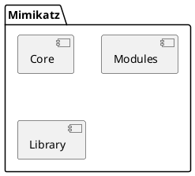

# Password and authentication credentials using Mimikatz

*Criedts for image (Varonis.com article - [What is Mimikatz? The Beginner&#39;s Guide (varonis.com)](https://www.varonis.com/blog/what-is-mimikatz))*

## 💭 Motivation

To be a better security professional, one quick way to understand more is by observation and playing around with the current known mechanisms to better understand and have quicker hands-on experience. Today's small project is infamous Mimikatz tool that is used by security professionals and attackers alike.

Small note, at the end of this post a glossary table that you can use to understand more about the acronyms and abbreviations used here.

## Introduction

### About Mimikatz

Mimikatz is a powerful open-source tool developed by [Benjamin Delpy (gentilkiwi)](https://github.com/gentilkiwi/mimikatz)that allows users to extract sensitive information from Windows operating systems, such as passwords and credentials. It has gained popularity among security professionals and hackers alike due to its ability to exploit vulnerabilities and perform various security-related tasks.

### Mimikatz functionalities

Mimikatz offers a wide range of functionalities related to Windows security and credential manipulation. Here are some of its key features:

* **Credential Extraction** : Mimikatz can retrieve plaintext passwords, hashes, and other credential information stored in Windows, including those used for local accounts, Active Directory, and cached credentials.
* **Pass-the-Hash** : This technique allows an attacker to authenticate to a remote system using the NTLM hash of a user's password, bypassing the need for the actual password.
* **Golden Ticket Attack** : Mimikatz can generate forged Kerberos tickets, known as Golden Tickets, by abusing the Kerberos authentication system. These tickets grant unauthorized access to a network by impersonating a domain controller.
* **Pass-the-Ticket** : With this technique, Mimikatz can extract and manipulate Kerberos tickets, allowing an attacker to impersonate a specific user or service.
* **Dumper** : Mimikatz includes various dumpers that extract and display information such as credentials stored in LSASS memory, domain-cached credentials, and security-related configurations.

### Understanding the architecture and how Mimikatz works

#### Architecture

Mimikatz follows a modular architecture that consists of several components working together to achieve its functionalities. Here is a high-level overview of its architecture:

* **Mimikatz Core** : The core component of Mimikatz provides the framework for loading modules, managing the command-line interface, and handling the interaction between different components.

* **Modules** : Modules in Mimikatz are responsible for performing specific tasks, such as credential extraction, token manipulation, and privilege escalation. Each module focuses on a particular functionality and can be loaded dynamically into the core.
* **Libraries** : Mimikatz leverages various libraries and APIs to interact with the Windows operating system and access sensitive information. These libraries provide the necessary functions for manipulating credentials, security subsystems, and other system components.

#### Internal working

Mimikatz utilizes various Windows APIs and techniques to access and manipulate sensitive information. Here is a high-level overview of its working process:

1. **Loading** : When executed, Mimikatz loads its core component, which sets up the necessary infrastructure for subsequent operations.
2. **Module Loading** : Modules containing specific functionalities are dynamically loaded into the core. These modules are responsible for performing different tasks, such as credential extraction or ticket manipulation.
3. **API Interactions** : Mimikatz leverages Windows APIs, security subsystem libraries, and other system components to access and manipulate credentials, tokens, and security configurations.
4. **Credential Extraction** : Mimikatz interacts with the Windows security subsystem to extract credentials from various sources, such as LSASS memory, cached credentials, and domain controllers.
5. **Credential Manipulation** : Once credentials are extracted, Mimikatz can perform actions such as displaying plaintext passwords, generating hashes, or impersonating users or services.
6. **Post-Exploitation** : After extracting and manipulating credentials, Mimikatz can use the obtained information to gain unauthorized access, escalate privileges, or perform other post-exploitation activities.

### List of supported modules

*[REF_MIMIKATZ_WIKI]*

Each module provides unique functionality and can be utilized for specific purposes. Below there is an overview of the different Mimikatz modules and their functionalities categorized by domain of utiliazation:

**1. Infrastructure helpers:**

* **mimilib** : Provides general support functions and structures for Mimikatz modules allowing more code portability and interoperability between modules.

**2. Credential manipulation and dumping:**

* **sekurlsa** : Interacts with the Local Security Authority Subsystem Service (LSASS) process to extract credentials, hashes, and other authentication-related information. It offers multiple sub-modules, including:
  * logonPasswords: Dumps plaintext passwords, NTLM hashes, and Kerberos tickets.
  * tickets: Manipulates Kerberos tickets.
  * dpapi: Decrypts or dumps data protected by the Data Protection API (DPAPI).
* **lsadump** : Offers various sub-modules to retrieve and manipulate data from the Local Security Authority (LSA) database, including:
  * sam: Dumps password hashes and other user account information from the Security Account Manager (SAM) database.
  * secrets: Extracts various secrets and credentials stored by Windows, such as autologon passwords and DPAPI backup keys.

**3. Token manipulation and impersonation:**

* **token** : Manipulates user tokens and provides functionalities for privilege escalation and impersonation.

**4. Kerberos-related operations:**

* **kerberos** : Performs operations related to Kerberos authentication, including:
  * ptt: Pass-the-ticket functionality, allowing the injection of Kerberos tickets into a user's session.

**5. Miscellaneous modules:**

* **service** : Manages services and can be used for installing, starting, and stopping services on the local or remote machine.
* **ts** : Manipulates Terminal Services sessions and credentials.
* **vault** : Dumps credentials and other information stored in the Windows Credential Manager (Vault).

## Glossary

| Acronym   | Description                                         |
| --------- | --------------------------------------------------- |
| API       | Application Program Interface                       |
| DP API    | Data Protection Application Program Interface       |
| LSASS     | Local Security Authority Subsystem Service          |
| NTLM hash | Hashed user's password in the NT LAN Manager (NTLM) |
| PTT       | Pass-the-ticket                                     |
| SAM       | Security Access Manager                             |

## References

1. *[REF_MIMIKATZ_WIKI]* [Home · gentilkiwi/mimikatz Wiki (github.com)](https://github.com/gentilkiwi/mimikatz/wiki)
2. *[REF_ARTICLE_SENTINELONE]* [What is Mimikatz and How Does it Work? | SentinelOne](https://www.sentinelone.com/cybersecurity-101/mimikatz/)
3. *[REF_ARTICLE_WOSHUB]* [Dumping User Passwords from Windows Memory with Mimikatz | Windows OS Hub (woshub.com)](https://woshub.com/how-to-get-plain-text-passwords-of-windows-users/)
