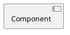

# Project

## Motivation

## Attack choice

### Understanding the overview of the attack

### How to perform this attack (PoC)

### Dive deep in tha attack mechanism

## Mitigation mechanism

### Overview of the mitigation/defence mechanism

### Applying the mechanism

### Check if the same attack can be prevented after applyting the mechanism

## Resources

1. [GitHub - puckiestyle/CVE-2022-0492](https://github.com/puckiestyle/CVE-2022-0492)

[New Linux Vulnerability CVE-2022-0492 Affecting Cgroups: Can Containers Escape? (paloaltonetworks.com)](https://unit42.paloaltonetworks.com/cve-2022-0492-cgroups/)

[ How To Fix CVE-2022-0492- Privilege Escalation And Container Escape Vulnerabilities In Cgroups - The Sec Master](https://thesecmaster.com/how-to-fix-cve-2022-0492-privilege-escalation-and-container-escape-vulnerabilities-in-cgroups/)

sudo -i

sudo docker pull us-central1-docker.pkg.dev/twistlock-secresearch/public/can-ctr-escape-cve-2022-0492:latest

sudo docker run --rm --security-opt apparmor=unconfined --security-opt seccomp=unconfined  --cgroup-parent=/sys/fs/cgroup/memory -it can-ctr-escape-cve-2022-0492 bash

sudo docker run --rm --security-opt=no-new-privileges --security-opt apparmor=unconfined --security-opt seccomp=unconfined  --cgroup-parent=/sys/fs/cgroup/memory -it us-central1-docker.pkg.dev/twistlock-secresearch/public/can-ctr-escape-cve-2022-0492 bash

sudo docker run --rm --security-opt=no-new-privileges --security-opt apparmor=unconfined --security-opt seccomp=unconfined us-central1-docker.pkg.dev/twistlock-secresearch/public/can-ctr-escape-cve-2022-0492:latest

unshare -UrmC bash

mkdir /tmp/mounttest && mount -t cgroup -o memory cgroup /tmp/mounttest && mkdir /tmp/mounttest/x

mount -t cgroup -o rdma cgroup /mnt && ls -la /mnt | grep release_agent

https://www.simplified.guide/ubuntu/remove-apparmor

ls -la /tmp/mounttest/x/

* 
* **Understanding attack techniques** : Researchers delve into the intricacies of operating system attacks, analyzing how vulnerabilities can be exploited, and studying attack patterns and methodologies used by adversaries.
* **Developing robust defenses** : Efforts are focused on designing and implementing effective security mechanisms to protect against attacks. This involves creating innovative techniques such as sandboxing, access control mechanisms, secure boot processes, and intrusion detection systems.
* **Evaluating and enhancing security** : Researchers conduct rigorous evaluations of existing security mechanisms and identify areas for improvement. This includes examining the effectiveness, performance, and usability of defenses, as well as proposing enhancements to ensure robust protection.

The research project evaluation: Pick the Project/attack/defense/security technique related to the operating system (as of your interest).

* **Research novelty and Analysis Quality (40%)**

  * Research how Project/attack/defense/security technique internally work. This involve using tools such as debuggers/API monitor to develop understanding how the subject of the research interacts with the operating system and what artifacts left behind (similar to your research in the Password Dump using Mimikatz)
  * Analysis novelty require showing evidence of debugging/analysis of the attack in your own. Avoid copy/paste/rewrite from public blog posts/etc
* **Proof Of Concept (30%)**

  * Develop PoC in C/C++ that explain (for example) how the attack can work? How the defense mechanism can be bypassed? How the defense mechanism can be disabled/enabled/manipulated?
* **Final Report (30%)**

  * The final report should be around 20 to 30 pages that have detailed analysis of the research subject, screen shot explaining how you debugged/analyzed the research/attack/defense/techniques and output of your analysis.
  * Any other additional logs you want to share (i.e. procmon logs/OS events/logs/etc)
